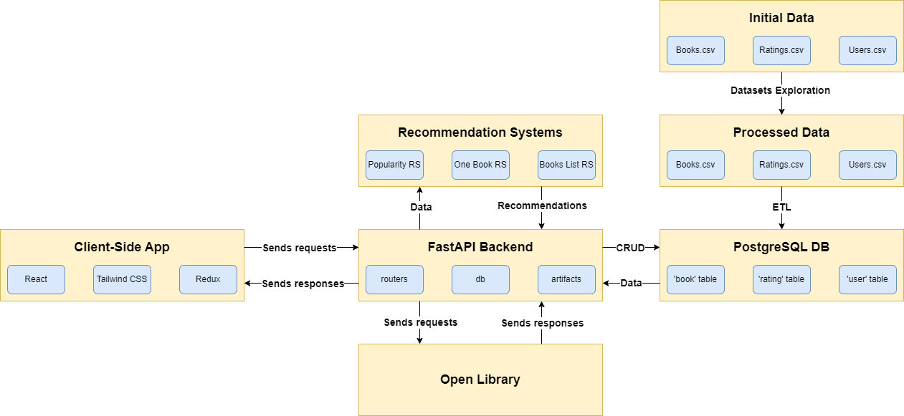

   
   <h2 align='center'>Book Recommendation System</h2>

   <i>
      A book recommendation web application built with React and Python that uses collaborative filtering to suggest book selections.
   </i>

 

## :dart: Objective
Develop an intuitive and efficient book recommendation system that enhances user experience by providing book suggestions based on collaborative filtering techniques.

## :bar_chart: Project pipeline

   

The implementation of the recommendation system involved the following steps:
1. **Searching for a Dataset on Kaggle**: using the ["Book Recommendation Dataset"](https://www.kaggle.com/datasets/arashnic/book-recommendation-dataset) dataset as the basis of a recommendation system.
2. **Dataset Exploration**: Performing the Data Quality Assessment (DQA) and Exploratory Data Analysis (EDA) stages in order to evaluate the dataset, identify and appropriately process outliers or anomalies, identify and analyze patterns and relationships in the data. The processed data, which is saved in separate files, is the result of this step.
3. **Extract, Transform, Load (ETL)**: Preparation and loading of data datasets into the corresponding tables of the PostgreSQL relational database.
4. **Creation of Recommendation Systems**: Use of data from processed datasets to build 3 recommender systems that will be used in the program.
5. **Implementation of the backend part**: Using the FastAPI framework to create an API that will use data from a dataset file and a database, refer to implemented recommender systems, and provide all necessary information to clients.
6. **Implementation of Client-Side App**: Creating a client in the form of a web application using React, Redux and Tailwind CSS.
7. **Usage of Open Library**: Using the Open Library API to correct dataset errors in the 'publication year' variable.

## :open_file_folder: Project Files Description
This project contains 2 folders (disregarding the 'readme_files' folder which contains the images for README.md):
1. **fastapi_backend**: Contains data (datasets), system code (in particular recommender systems code, backend server code) and artifacts (jupyter notebooks, database schemas).
2. **react_frontend**: Contains the code of the client-side web application developed with React, Redux (for state management), and Tailwind CSS (for styling).